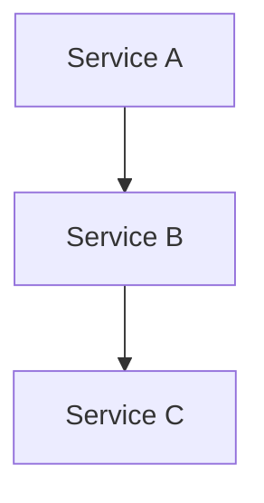

# Homelab documentation

Documentation for self-hosted services running on Proxmox.

## Structure

- `services/` - One file per service
- `how-to/` - Step-by-step procedures
- `infrastructure/` - Network, storage, Proxmox, LXC setup
- `troubleshooting/` - Problem/solution pairs
- `templates/` - Templates for service docs and how-tos

## Service doc frontmatter

```yaml
---
service: name
status: running | stopped | planned
host: hostname
port: number
tags: []
updated: YYYY-MM-DD
---
```

## How-to frontmatter

```yaml
---
type: how-to
tags: []
last-tested: YYYY-MM-DD
---
```

## Working preferences

- Use templates from `templates/` when creating new docs
- Update `updated` or `last-tested` dates when modifying docs
- Reference `~/dev/homelab-docker` for Docker Compose details

## Diagrams

This site uses Quartz, which has native Mermaid support. When creating diagrams:

- **Use Mermaid** for architecture, flow, and relationship diagrams
- Use code blocks (` ```bash `, ` ```yaml `) for commands, configs, and code
- Do not use ASCII art in code blocks for visual diagrams

Mermaid example:
````markdown

````
