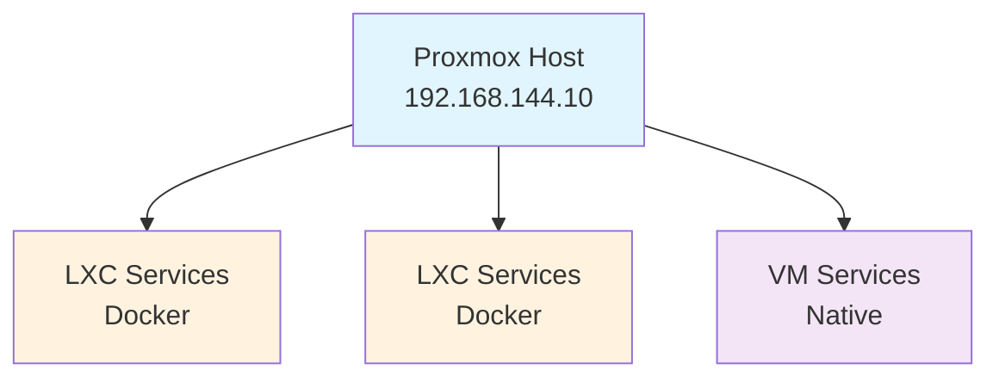

# Homelab Documentation

Complete documentation for the home lab running on Proxmox VE. Everything needed to understand, maintain, rebuild, or extend the setup.

## Quick Links

- [[infrastructure/proxmox|Proxmox Setup]] - Virtualization host and container basics
- [[infrastructure/network|Network Topology]] - IP ranges, DNS, routing
- [[infrastructure/storage|Storage Configuration]] - ZFS and data persistence
- [[services/all-services|Service Inventory]] - All services at a glance

## At a Glance

**Host:** Proxmox VE on dedicated hardware
**Network:** 192.168.144.0/23, gateway .1, DNS .20 (Pi-hole)
**Storage:** ZFS with `/lxcdata/` for persistent data
**Services:** 11 LXC containers + 2 VMs

### Architecture Overview

**Access Pattern:**
- **External:** Cloudflare Tunnel → Internal service
- **Internal:** Lanproxy (Caddy) → Internal service
- **Direct:** Local IP + port

## Service Categories

### Web & CMS
- [[services/grav|Grav]] - Flat-file CMS (opa.janvv.nl, www.janvv.nl)
- [[services/wordpress-jokegoudriaan|WordPress - jokegoudriaan.nl]]
- [[services/wordpress-kledingruil|WordPress - kledingruil]]
- [[services/wordpress-pgh|WordPress - pgh.janvv.nl]]

### Applications
- [[services/planka|Planka]] - Project management / Kanban (tasks.janvv.nl)
- [[services/immich|Immich]] - Photo management (photos.janvv.nl)
- [[services/home-assistant|Home Assistant]] - Home automation (assistant.janvv.nl)
- [[services/syncthing|Syncthing]] - File synchronization (sync.janvv.nl)

### Automation & AI
- [[services/n8n|n8n]] - Workflow automation (n8n.janvv.nl)
- [[services/ai|AI Services]] - Ollama + Open WebUI

### Media
- [[services/jellyfin|Jellyfin]] - Media server (kijkdoos.janvv.nl)

### Infrastructure Services
- [[services/wordpress-db|MariaDB]] - Shared database for WordPress sites
- [[services/lanproxy|Lanproxy]] - Caddy reverse proxy for internal HTTPS
- [[services/cloudflared|Cloudflared]] - Cloudflare tunnel for external access

## How-To Guides

**Getting Started:**
- [[how-to/deploy-new-service|Deploy a New Service]] - Add a service from scratch
- [[how-to/access-container|Access Containers]] - SSH and pct command patterns

**Maintenance:**
- [[how-to/update-service|Update a Service]] - Pull images and restart
- [[how-to/backup-restore|Backup & Restore]] - Data and database procedures

**Troubleshooting:**
- [[how-to/troubleshoot-service|Troubleshoot Service Issues]] - Common problems and solutions
- [[how-to/restore-from-scratch|Complete Restore from Scratch]] - Disaster recovery

## External URLs

| Service | URL | Notes |
|---------|-----|-------|
| Planka | https://tasks.janvv.nl | Project management |
| n8n | https://n8n.janvv.nl | Workflow automation |
| Grav | https://opa.janvv.nl | Main website |
| Jellyfin | https://kijkdoos.janvv.nl | Media streaming |
| WordPress jokegoudriaan | https://jokegoudriaan.nl | Client site |
| WordPress kledingruil | https://kledingruil.jokegoudriaan.nl | Client site |
| WordPress pgh | https://pgh.janvv.nl | Personal site |
| Immich | https://photos.janvv.nl | Photo backup |
| Home Assistant | https://assistant.janvv.nl | Home automation |
| Syncthing | https://sync.janvv.nl | File sync |
| Pi-hole | https://pihole.janvv.nl | DNS/ad blocking |
| Proxmox | https://proxmox.janvv.nl | Virtualization host |

## Repository

The Docker Compose configurations are in `~/dev/homelab-docker/`. Each service has its own directory with:
- `docker-compose.yml` - Service definition
- `install.sh` - Deployment script
- `README.md` - Service-specific notes
- `.env.example` - Environment variable template

## Tag Reference

LXC containers are tagged by purpose:
- **Automation** - Workflow automation (n8n)
- **App** - Application services (Planka, Syncthing)
- **Web** - Web servers (Grav, WordPress)
- **AI** - AI/ML services (Ollama, Open WebUI)
- **Media** - Media streaming (Jellyfin)
- **Network** - Networking (Cloudflared, Lanproxy)
- **Database** - Databases (MariaDB)
- **Template** - Base templates for cloning
