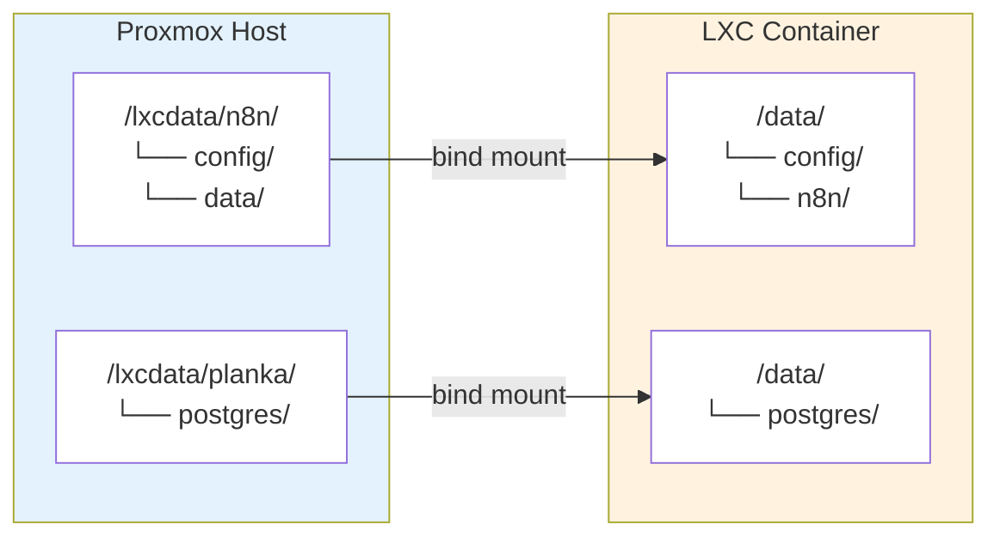

# Storage Configuration

Data persistence strategy using ZFS and bind mounts for LXC containers.

## Overview

**Storage Type:** ZFS with 4 pools
**Primary Data Pool:** `ssd_pool` (3.62T)
**Service Data Location:** `/lxcdata/<service>/` on Proxmox host
**Container Mount Point:** `/data` (inside LXC)

## ZFS Pools

| Pool | Size | Used | Free | Purpose |
|------|------|------|------|---------|
| `backup_pool` | 1.81T | 762G | 1.07T | Backups, ISOs, templates |
| `nvme_pool` | 928G | 121G | 807G | Container root disks, VM disks |
| `rpool` | 230G | 14G | 216G | Proxmox boot/system |
| `ssd_pool` | 3.62T | 1.21T | 2.42T | Service data, VM data, media |

## ssd_pool Datasets

| Dataset | Mount Point | Contents | Compression |
|---------|-------------|----------|-------------|
| `lxcdata` | `/lxcdata` | Service bind mounts | lz4 |
| `vmdata` | `/vmdata` | VM images, Immich photos | on |
| `media` | `/ssd_pool/media` | Films, series, videos | off |
| `databases` | `/databases` | MSSQL | lz4 |

## Architecture



## ZFS Benefits

- **Snapshots:** Point-in-time recovery
- **Compression:** Transparent storage savings (lz4 on most datasets)
- **Send/Receive:** Efficient backup/replication
- **Data Integrity:** Automatic checksum verification

## Data Directory Structure

Each service has dedicated data on the host:

```bash
/lxcdata/
├── ai/                       # CT 124 - Ollama models
├── grav/                     # CT 123 - Flat-file content
├── jellyfin/                 # CT 125 - Media metadata
├── lanproxy/                 # CT 127 - Caddy config
├── n8n/                      # CT 120 - Workflow data
├── planka/                   # CT 122 - Project data
├── syncthing/                # CT 121 - File sync (orphaned, CT deleted)
├── wordpress-db/             # CT 128 - MariaDB data
├── wordpress-jokegoudriaan/  # CT 129 - WordPress files
├── wordpress-kledingruil/    # CT 130 - WordPress files
└── wordpress-pgh/            # CT 131 - WordPress files
```

## VM Data

```bash
/vmdata/
├── dump/                     # VM exports
├── images/                   # VM images
├── immich-photos/            # Immich photo storage
├── imports/                  # Imported VM images
├── laptop.qcow2              # ~296GB laptop image
├── private/                  # Private VM data
└── template/                 # VM templates
```

## Creating Data Directory

When deploying a new service:

```bash
# On Proxmox host - create dataset
mkdir -p /lxcdata/<service>

# Add mount point to container config
pct set <CT_ID> -mp0 /lxcdata/<service>,mp=/data
```

## Backup Strategy

### What to Backup

**Service Data:** `/lxcdata/<service>/` on host
- Application data (databases, uploads, configs)

**VM Data:** `/vmdata/` on host
- Immich photos, VM images, templates

**Proxmox Configs:** Container/VM definitions
```bash
# LXC config backup
cat /etc/pve/lxc/<CT_ID>.conf > /backups/lxc-<CT_ID>-$(date +%F).conf

# VM config backup
cat /etc/pve/qemu-server/<VM_ID>.conf > /backups/vm-<VM_ID>-$(date +%F).conf
```

### Backup Methods

**ZFS Snapshots:**
```bash
# Snapshot specific service data
zfs snapshot ssd_pool/lxcdata/<service>@before-update

# List snapshots
zfs list -t snapshot

# Restore snapshot
zfs rollback ssd_pool/lxcdata/<service>@before-update
```

**File Backup:**
```bash
# Service data to backup pool
rsync -av /lxcdata/<service>/ /backup_pool/lxcdata-backups/<service>/

# VM data to backup pool
rsync -av /vmdata/<service>/ /backup_pool/vmdata-backups/<service>/
```

**Database Dumps:** See [[how-to/backup-restore|Backup & Restore]]

## Restore Procedures

### From ZFS Snapshot

```bash
# Rollback to snapshot (destructive - reverts changes)
zfs rollback ssd_pool/lxcdata/<service>@snapshot-name

# Clone snapshot (non-destructive - creates copy)
zfs clone ssd_pool/lxcdata/<service>@snapshot-name ssd_pool/lxcdata/<service>-restore
```

### From File Backup

```bash
# Restore service data
rsync -av /backup_pool/lxcdata-backups/<service>/ /lxcdata/<service>/

# Restart container to pick up restored data
pct restart <CT_ID>
```

## Permissions

### Unprivileged LXC UID Mapping

Unprivileged LXC containers map UIDs with +100000 offset:

| Container UID | Host UID | Common Use |
|---------------|----------|------------|
| 33 (www-data) | 100033 | Web servers |
| 70 (postgres) | 100070 | PostgreSQL |
| 999 (mysql) | 100999 | MariaDB |
| 1000 | 101000 | App-specific |

### Fixing Permissions

If service can't write to `/data`:

```bash
# On Proxmox host
chown -R <container_uid + 100000>:<container_gid + 100000> /lxcdata/<service>/<dir>

# Example: Fix WordPress permissions (www-data = 33 → 100033)
chown -R 100033:100033 /lxcdata/wordpress-jokegoudriaan/
```

## Cleanup & Action Items

The following items were discovered during verification and need attention:

### Orphaned/Legacy Directories in `/lxcdata`

| Directory | Size | Status | Action Needed |
|-----------|------|--------|---------------|
| `syncthing/` | - | Orphaned | CT 121 deleted - safe to remove |
| `wp-jokegoudriaan/` | 3.3G | Duplicate | Old WordPress data - safe to remove |
| `wp-kledingruil/` | 191M | Duplicate | Old WordPress data - safe to remove |
| `wp-pgh/` | 8.9G | Duplicate | Old WordPress data - safe to remove |
| `docker-web/` | - | Old | Contains old grav/nginx - evaluate |
| `plex/` | - | Old | Replaced by jellyfin - safe to remove |
| `srvweb1/` | - | Old | Contains old nginx/www - evaluate |
| `mariadb/` | Empty | Unused | Empty directory - safe to remove |
| `postgresql/` | - | Old | Old postgresql data - evaluate |

**Total potential space savings: ~12.4GB**

### Documentation Updates Needed

- [ ] Document CT 121 (syncthing) status - delete doc or mark as removed?
- [ ] Add note about CT 126 (cloudflared) being stateless (no data mount)
- [ ] Document `/vmdata` usage for VM images and Immich
- [ ] Document `/ssd_pool/media` for media library
- [ ] Document `/databases` for MSSQL

### Service Docs to Verify

- [ ] CT 126 (tunnel/cloudflared) - verify it's stateless in docs
- [ ] VM 108 (immich) - confirm photo storage location

## Related

- [[how-to/backup-restore|Backup & Restore Procedures]]
- [[infrastructure/proxmox|Proxmox Configuration]]
